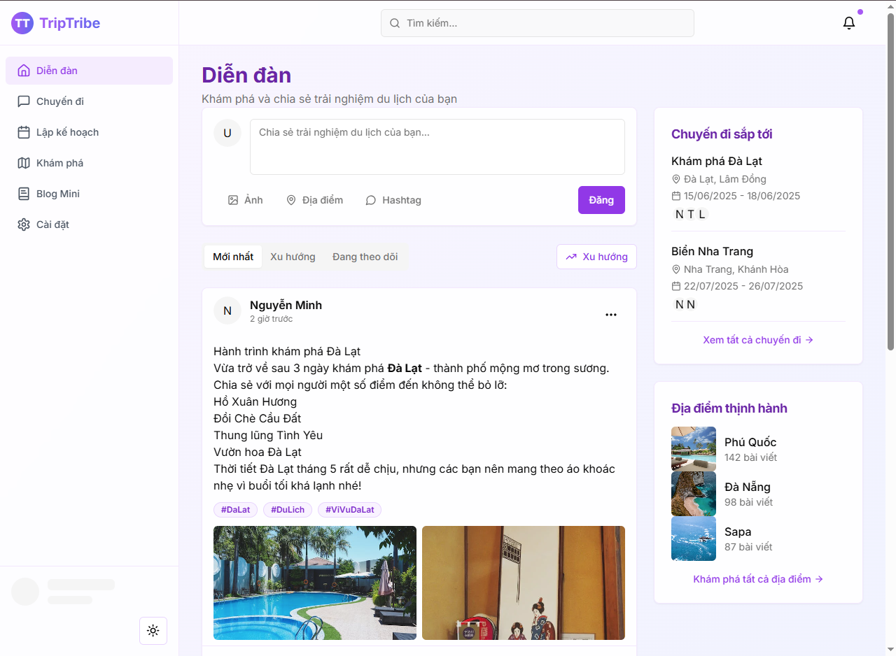

# TravelLog

TravelLog là một ứng dụng web giúp người dùng khám phá, chia sẻ và lưu giữ những kỷ niệm du lịch của họ. Dự án được xây dựng bằng [Next.js](https://nextjs.org/) và tích hợp với các công nghệ hiện đại như Tailwind CSS, React, và nhiều thư viện hỗ trợ khác.

<div>
    
</div>

## 🚀 Tính năng chính

- **Khám phá địa điểm**: Duyệt qua các địa điểm du lịch phổ biến và tìm kiếm cảm hứng cho chuyến đi tiếp theo.
- **Blog du lịch**: Viết và chia sẻ trải nghiệm du lịch của bạn với cộng đồng.
- **Lưu giữ kỷ niệm**: Tạo album ảnh và lưu giữ những khoảnh khắc đáng nhớ.
- **Tích hợp bản đồ**: Xem vị trí các địa điểm trên bản đồ tương tác.
- **Xác thực người dùng**: Đăng nhập và đăng ký tài khoản để cá nhân hóa trải nghiệm.

## 🛠️ Công nghệ sử dụng

- **Frontend**: [Next.js](https://nextjs.org/), [React](https://reactjs.org/), [Tailwind CSS](https://tailwindcss.com/)
- **Backend**: Tích hợp API với Next.js
- **Thư viện hỗ trợ**:
  - `lucide-react` để hiển thị biểu tượng
  - `date-fns` để xử lý ngày tháng
  - `react-map-gl` để tích hợp bản đồ

## 📂 Cấu trúc thư mục


```plaintext
.
├── app/
│   ├── globals.css          # File CSS toàn cục
│   ├── layout.tsx           # Layout chính của ứng dụng
│   ├── page.tsx             # Trang chính
│   ├── providers.tsx        # Cung cấp context và provider
│   ├── auth/                # Chức năng xác thực
│   ├── blog/                # Chức năng blog
│   ├── explore/             # Chức năng khám phá
├── components/              # Các thành phần giao diện
├── hooks/                   # Custom hooks
├── lib/                     # Các thư viện và tiện ích
├── .next/                   # Thư mục build của Next.js
├── public/                  # Tài nguyên tĩnh
```

## 📦 Cài đặt

1. Clone dự án:
   ```bash
   git clone https://github.com/harryitc/social-travel-trip.git
   cd social-travel-trip
   ```

2. Cài đặt các gói:
   ```bash
   npm install
   ```

3. Chạy ứng dụng:
   ```bash
   npm run dev
   ```

## 🤝 Chia sẻ cảm nghĩ

Chia sẻ cảm nghĩ của bạn về dự án này và giúp chúng tôi cải thiện nó. Đóng góp của bạn rất quý giá!

## 📝 Giấy phép

Dự án này được cấp phép theo giấy phép MIT. Xem tệp LICENSE để biết thêm thông tin.

## 🤝 Đóng góp

Chúng tôi rất vui mừng khi nhận được đóng góp từ cộng đồng. Vui lòng xem tệp CONTRIBUTING.md để biết thêm thông tin về cách đóng góp cho dự án này.
1. Fork dự án này.
2. Tạo một nhánh mới:
   ```bash
   git checkout -b feature/your-feature-name
   ```
3. Thực hiện các thay đổi của bạn và cam kết:
   ```bash
   git commit -m "Mô tả ngắn gọn về thay đổi"
   ```
4. Đẩy nhánh của bạn lên GitHub:
   ```bash
   git push origin feature/your-feature-name
   ```
5. Tạo một pull request và mô tả các thay đổi của bạn.
